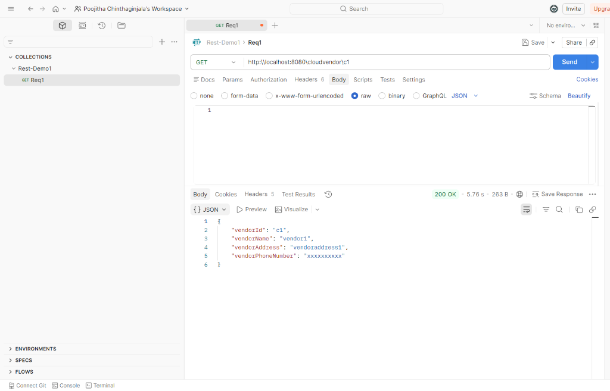
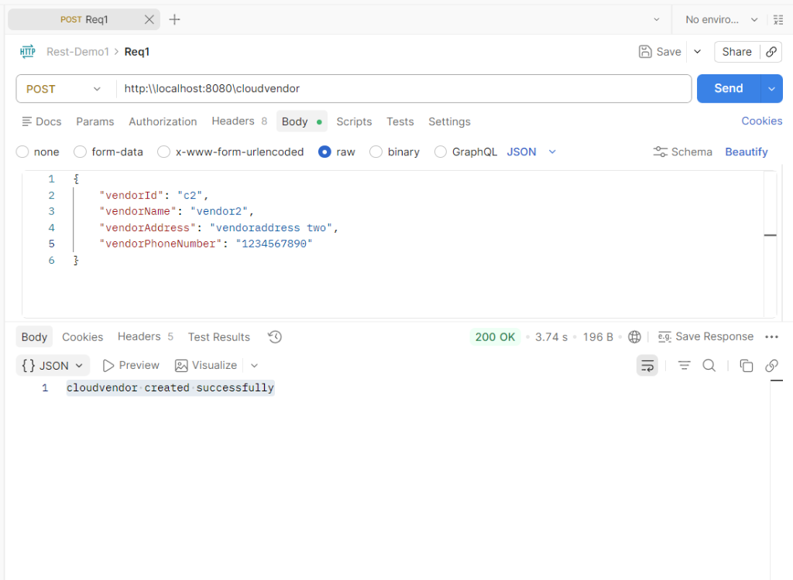
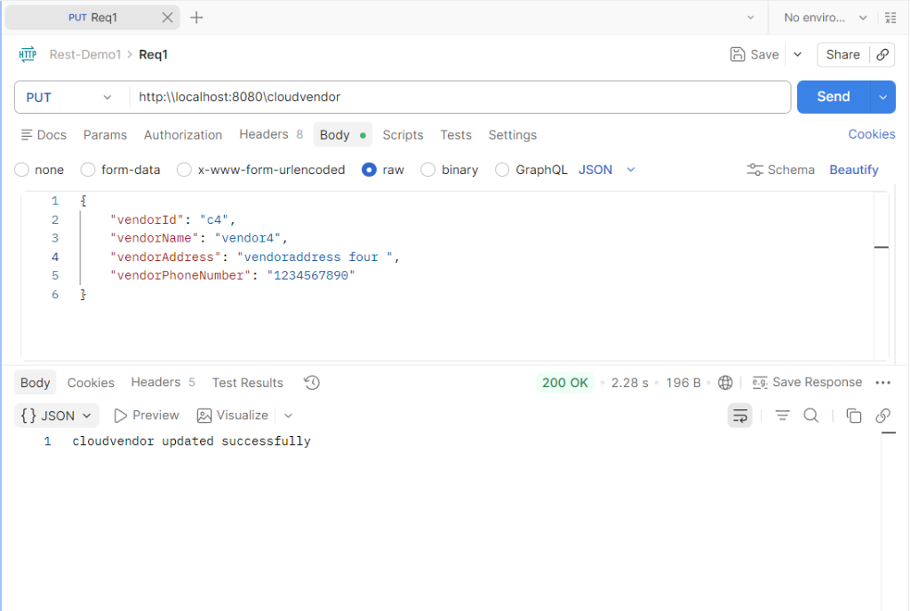
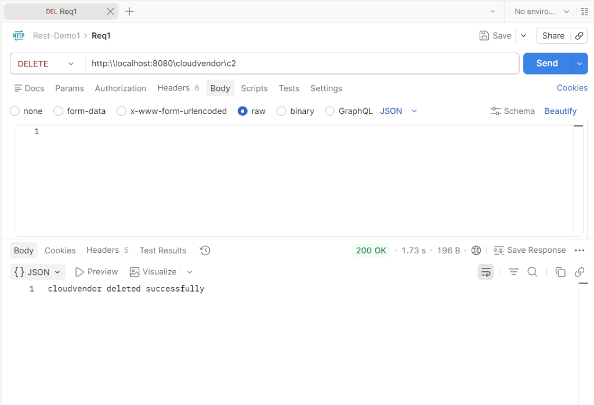

# Cloud Vendor REST API

This is a Spring Boot application demonstrating a basic RESTful API for managing Cloud Vendors. It provides Create, Read, Update, and Delete (CRUD) operations for the `cloudvendor` entity.

## Features

- **Create Cloud Vendor**: Add a new cloud vendor to the system.
- **Get Cloud Vendor**: Retrieve details of an existing cloud vendor using their ID.
- **Update Cloud Vendor**: Modify the details of an existing cloud vendor.
- **Delete Cloud Vendor**: Remove a cloud vendor from the system.

## Technologies Used

- **Java 17**
- **Spring Boot 3.4.x / 4.x** (Spring Web MVC)
- **Maven**

## Project Structure

The project follows the standard Spring Boot directory structure:

- `src/main/java/com/thinkconstructive/rest_demo/controller/cloudvendorAPIservice.java`: Contains the REST controller exposing the CRUD API endpoints.
- `src/main/java/com/thinkconstructive/rest_demo/model/cloudvendor.java`: The POJO (Plain Old Java Object) representing the Cloud Vendor entity.

## API Endpoints and Expected Outcomes

The API is accessible under the base URL `/cloudvendor`. Here are detailed examples of each operation:

### 1. Get Cloud Vendor
- **Method:** `GET`
- **Endpoint:** `/cloudvendor/{vendorId}`
- **Example Request:** `http://localhost:8080/cloudvendor/c1`
- **Expected Output:**
  ```json
  {
      "vendorId": "c1",
      "vendorName": "vendor1",
      "vendorAddress": "vendoraddress1",
      "vendorPhoneNumber": "xxxxxxxxxx"
  }
  ```
  

### 2. Create Cloud Vendor
- **Method:** `POST`
- **Endpoint:** `/cloudvendor`
- **Example Request Body (JSON):**
  ```json
  {
      "vendorId": "c2",
      "vendorName": "vendor2",
      "vendorAddress": "vendoraddress two",
      "vendorPhoneNumber": "1234567890"
  }
  ```
- **Expected Output:**
  ```text
  cloudvendor created successfully
  ```
  

### 3. Update Cloud Vendor
- **Method:** `PUT`
- **Endpoint:** `/cloudvendor`
- **Example Request Body (JSON):**
  ```json
  {
      "vendorId": "c4",
      "vendorName": "vendor4",
      "vendorAddress": "vendoraddress four ",
      "vendorPhoneNumber": "1234567890"
  }
  ```
- **Expected Output:**
  ```text
  cloudvendor updated successfully
  ```
  

### 4. Delete Cloud Vendor
- **Method:** `DELETE`
- **Endpoint:** `/cloudvendor/{vendorId}`
- **Example Request:** `http://localhost:8080/cloudvendor/c2`
- **Expected Output:**
  ```text
  cloudvendor deleted successfully
  ```
  

## How to Run

1. Make sure you have **Java 17** or above and **Maven** installed.
2. Clone or download the repository.
3. Open a terminal or command prompt and navigate to the root directory of the project (where `pom.xml` is located).
4. Run the application using the Maven wrapper:

   **On Windows:**
   ```bash
   mvnw.cmd spring-boot:run
   ```

   **On Linux/macOS:**
   ```bash
   ./mvnw spring-boot:run
   ```

5. The application will start on the default port, usually `8080`.
6. You can use tools like [Postman](https://www.postman.com/) or `curl` to test the API endpoints.
